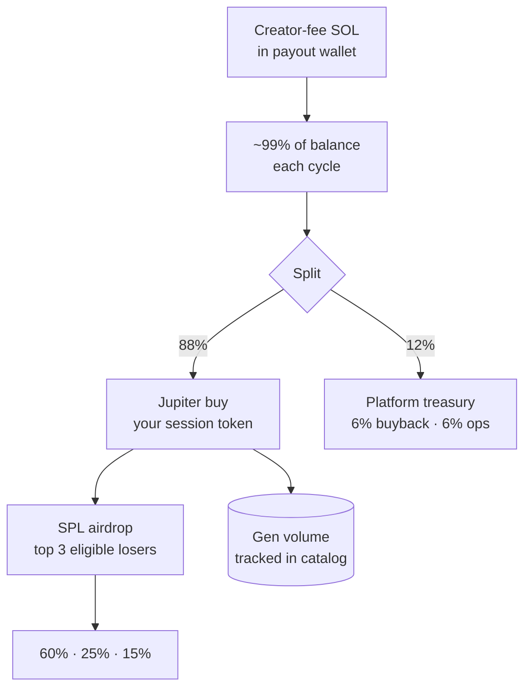

<div align="center">

# TopBlast

**Loss-mining rewards · on-chart volume · Solana**

Turn creator-fee SOL into Jupiter buybacks and token airdrops for your most underwater holders — every cycle.

<br />

[](https://topblasted.fun)
[](https://topblasted.fun/launch)
[](https://whitepaper.topblasted.fun)
[](https://topblasted.fun/catalog)

<br />


<br />

[Whitepaper](https://whitepaper.topblasted.fun) · [GitHub](https://github.com/Tanner253/TB) · [X / @oSKNYo_dev](https://x.com/oSKNYo_dev)

</div>

<br />

## At a glance

| | **Cashback bots** | **TopBlast** |
| :-- | :-- | :-- |
| Who gets paid | Traders farming sell-side volume | Underwater holders in drawdown |
| Chart effect | Rebates reward exits | Jupiter **buys your token** each cycle |
| Reward type | SOL (exit liquidity) | Your session token |
| Volume tracking | — | **Gen volume** in catalog |

> **Gen volume** = cumulative SOL the protocol has market-bought into your mint across all payout cycles.

<br />

## How a cycle works



| Setting | Value |
| :-- | :-- |
| Winner split | **60%** · **25%** · **15%** (1st / 2nd / 3rd) |
| Cycle length | **15m** · 30m · 1h · 2h · 4h · 6h — set at launch |
| Timer starts | When the **first eligible holder** appears |
| Default payouts | `PAYOUT_AS_NATIVE_TOKEN=true` → token airdrops, not SOL |

<br />

## Features

<table>
<tr>
<td width="50%" valign="top">

### For launchers

- **Self-serve** — [`/launch`](https://topblasted.fun/launch) with encrypted payout keys
- **Isolated sessions** — `/[slug]/leaderboard` · `/history` · `/stats`
- **Live catalog** — sort by pot, Gen volume, total paid out
- **Diagnostics** — empty pool, indexing, no eligible holders
- **Pump.fun ready** — DexScreener through bonding curve → migration

</td>
<td width="50%" valign="top">

### For holders

- **VWAP drawdown** rankings via Helius buy history
- **Eligibility gates** — min balance, 15m hold, dynamic min loss, no sells out
- **Automatic airdrops** — wallet-to-wallet, no claim button
- **Winner cooldown** — previous winners sit out one cycle

</td>
</tr>
</table>

<br />

## Tech stack

| Layer | Stack |
| :-- | :-- |
| Frontend | Next.js 14 · React 18 · TypeScript · Tailwind |
| Chain | Solana mainnet · Helius RPC/DAS · SPL |
| Swaps | Jupiter (SOL → session token) |
| Data | MongoDB · encrypted tenant keys |
| Pricing | DexScreener · Jupiter/Helius fallbacks |
| Deploy | Vercel |

<br />

## Roadmap

| Status | Item |
| :--: | :-- |
| ✅ | Solana loss-mining · VWAP drawdown rankings |
| ✅ | Multi-tenant SaaS · catalog · encrypted keys |
| ✅ | Native-token payouts · Jupiter buy + SPL airdrop |
| ✅ | Gen volume tracking · slippage retries |
| 🔲 | Automated platform-token buyback + burn |
| 🔲 | Public analytics API for launchers |

<br />

---

<br />

<details>
<summary><strong>Local development</strong></summary>

<br />

**Prerequisites:** Node 18+ · MongoDB · [Helius API key](https://helius.dev)

```bash
git clone https://github.com/Tanner253/TB.git
cd TB/TopBlast
npm install
cp env.example.txt .env.local
# Edit .env.local — see env.example.txt
npm run dev
```

Open [http://localhost:3000](http://localhost:3000).

```bash
npm test          # unit tests
npm run lint      # eslint
```

</details>

<details>
<summary><strong>Environment variables</strong></summary>

<br />

Full list: `TopBlast/env.example.txt`

| Variable | Purpose |
| :-- | :-- |
| `MONGODB_URI` | Database connection |
| `HELIUS_API_KEY` | Holder indexing + tx history |
| `TENANT_ENCRYPTION_KEY` | AES-256-GCM for payout keys at rest |
| `PAYOUT_AS_NATIVE_TOKEN` | `true` = Jupiter buy + token airdrop (default) |
| `PAYOUT_SWAP_MAX_RETRIES` | Slippage escalation retries (default `3`) |
| `EXECUTE_PAYOUTS` | `true` in production to sign transactions |
| `DEV_WALLET_ADDRESS` | Receives 12% protocol fee each cycle |
| `PLATFORM_TENANT_SLUG` | Platform token slug (default `topblast`) |
| `CRON_SECRET` | Auth for cron/admin routes |

</details>

<details>
<summary><strong>API reference</strong></summary>

<br />

**Public**

| Method | Endpoint | Description |
| :-- | :-- | :-- |
| `GET` | `/api/tenants` | Catalog listings (pot, Gen volume, status) |
| `GET` | `/api/leaderboard` | Platform token rankings |
| `GET` | `/api/t/[slug]/leaderboard` | Tenant rankings |
| `GET` | `/api/history` | Payout history |
| `GET` | `/api/stats` | Session stats |

**Protected** (cron / admin — requires `CRON_SECRET`)

| Method | Endpoint | Description |
| :-- | :-- | :-- |
| `POST` | `/api/cron/tenants` | Snapshots + payouts for all active tenants |
| `POST` | `/api/cron/snapshot` | Legacy single-token snapshot |
| `POST` | `/api/cron/payout` | Legacy single-token payout |

Payouts also fire when the leaderboard timer hits zero during API polling.

</details>

<details>
<summary><strong>Repository layout</strong></summary>

<br />

```
TB/
├── TopBlast/          # Main app — payout engine, API, UI
├── whitepaper/        # Docs site → whitepaper.topblasted.fun
└── README.md
```

```
TopBlast/
├── app/
│   ├── launch/              # Self-serve listing form
│   ├── catalog/             # Multi-tenant catalog
│   ├── leaderboard/         # Platform token session
│   ├── [slug]/              # Per-tenant pages
│   └── api/
│       ├── tenants/         # Catalog + launch
│       ├── cron/tenants/    # Multi-tenant payout cron
│       └── t/[slug]/        # Tenant-scoped APIs
├── lib/
│   ├── payout/executor.ts   # Payout + Jupiter + airdrop
│   ├── platform/catalogMetrics.ts
│   └── tenant/
└── env.example.txt
```

</details>

<details>
<summary><strong>Security</strong></summary>

<br />

- Payout private keys encrypted with **AES-256-GCM** before MongoDB storage
- Keys decrypted only during that listing's payout execution
- Cron and admin routes require **`CRON_SECRET`**
- Dev wallet and payout wallet excluded from rankings
- Frontend is read-only — no wallet connect for holders

</details>

<br />

---

<div align="center">

<br />

**[topblasted.fun](https://topblasted.fun)** · **[whitepaper.topblasted.fun](https://whitepaper.topblasted.fun)**

<br />

*When you drawdown, we blast you up.*

<br />

</div>
